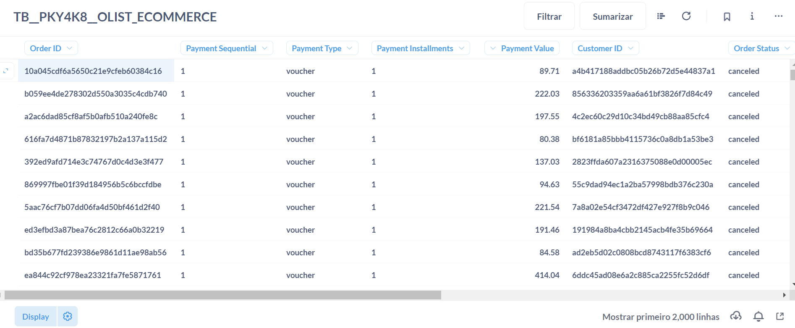
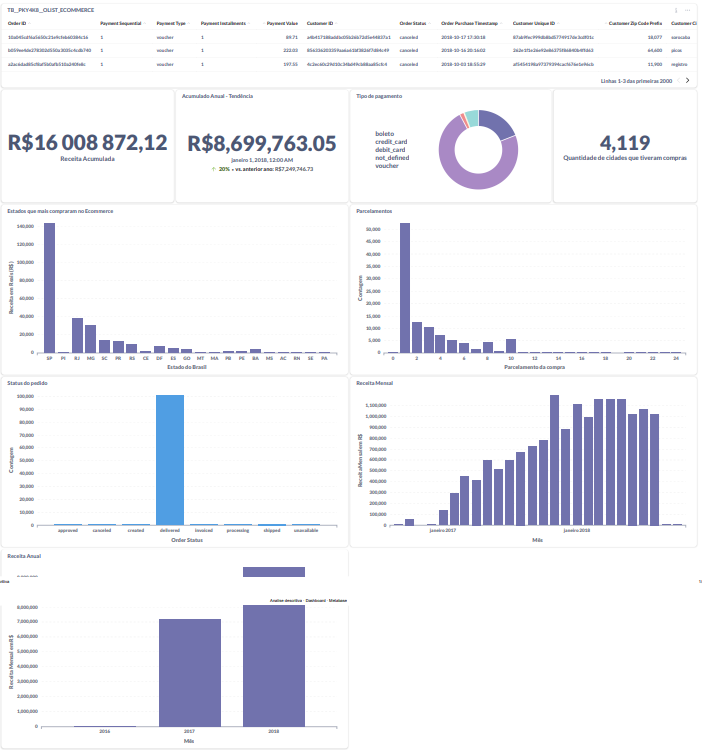
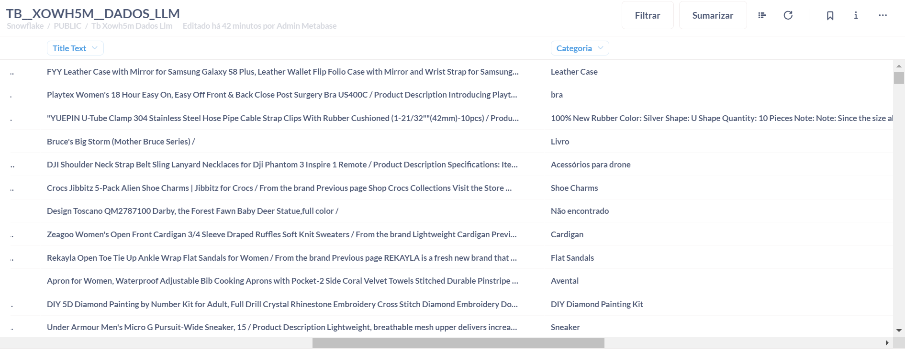

# Respostas do Teste

## Item 1: Sobre a Base de Dados

O Dataset utilizado foi o de ecommerce da Olist, disponível no [Kaggle](https://www.kaggle.com/datasets/olistbr/brazilian-ecommerce).

### Configuração do Dataset

Foram utilizados os seguintes datasets:

- `olist_customers_dataset`
- `olist_order_payment_dataset`
- `olist_orders_dataset`

### Detalhes do Processamento

Os datasets foram agrupados e foi criado um novo dataset consolidado contendo informações dos pedidos, pagamentos e clientes.

### Visualização do Dataset

Após o processamento, na camada `processed`, obtivemos o seguinte dataset:

### Link para o Dataset

Você pode encontrar o dataset em:
[Dataset Pedidos na Dadosfera](https://app.dadosfera.ai/pt-BR/catalog/data-assets/4561c0ac-e579-481b-b628-a5f83c58668a)

O ID é: `TB__PKY4K8__OLIST_ECOMMERCE`

## Pergunta 2: Análise descritiva"

O dashboard de análise descritiva segue abaixo e nos permite identificar os seguintes principais pontos:

### Resumo do Dashboard

- **ID do Dataset:** `TB__PKY4K8__OLIST_ECOMMERCE`
- **Receita Acumulada:** R$ 16.008.872,12
- **Receita Acumulada Anual:** R$ 8.699.763,05 (Tendência de 20% de aumento)

### Seções e Análises

#### 1. Receita Acumulada

- **Valor Total:** R$ 16.008.872,12
- **Descrição:** Este valor representa a soma total das receitas geradas pelas vendas no ecommerce entre 2016 a 2018. 

#### 2. Acumulado Anual - Tendência

- **Valor Anual Atual:** R$ 8.699.763,05
- **Comparação Anual:** 20% de aumento comparado ao ano anterior (R$ 7.249.746,72)

#### 3. Tipos de Pagamento

- **Principais Métodos:** Boleto, Cartão de Crédito, Cartão de Débito, Voucher
- **Descrição:** Dentre os métodos de pagamento o boleto e cartão de crédito foram os métodos mais utilizados, com crédito chegando a aproximadamente 77% e boleto 19.7%

#### 4. Quantidade de Cidades com Compras

- **Total de Cidades:** 4.119
- **Descrição:** O total de cidades impactadas pelo ecommerce no Brasil foi de 4119.

#### 5. Estados que mais Compram no Ecommerce

- **Líderes em Compras:** São Paulo (SP), Minas Gerais (MG), Rio de Janeiro (RJ)
- **Descrição:** Mostra a distribuição das vendas por estado, com os estados do sudeste liderando em volume de compras. Portanto, gera-se uma ideia de onde direcionar as campanhas de marketing com criativos do facebook e google ads.

#### 6. Parcelamentos

- **Principais Faixas:** 1 a 3 parcelas
- **Descrição:** A maioria das compras são parceladas entre 1 a 3 vezes, indicando a preferência dos consumidores por pagamentos a curto prazo. 

#### 7. Status do Pedido

- **Status Principais:** Delivered (entregue), Cancelled (cancelado)
- **Descrição:** A maioria dos pedidos estão com status "entregue", seguido por um número considerável de pedidos "cancelados". 

#### 8. Receita Mensal

- **Tendência Mensal:** Crescimento até junho de 2018, com picos em determinados meses
- **Descrição:** O gráfico de receita mensal mostra um crescimento constante, com variações sazonais. 

#### 9. Receita Anual

- **Comparação Anual:** Crescimento de 2016 para 2017, leve queda em 2018
- **Descrição:** O gráfico compara a receita anual ao longo dos anos, mostrando um aumento significativo de 2016 para 2017 e uma leve queda em 2018. 

### Link para o Dashboard

O dashboard pode ser analisado no seguinte link:

## Pergunta 3: Sobre a Dadosfera - Explorar - Governança de dados

Os dados foram catalogados na dadosfera e divididos em 3 principais áreas.

Raw data: os csvs importados foram colocados primeiramente nessa camada. (TB__UHWGOI__OLIST_ORDER_PAYMENTS_DATASET, )
processed: o processamento desses dados realizando os agrupamentos necessários. (Interno no código)
Curated: Os dados que foram utilizados para realizar a montagem do dashboard no dadosfera. (TB__PKY4K8__OLIST_ECOMMERCE)

## Pergunta 4: Sobre Data quality

# Melhorando a Qualidade dos Dados no Ecommerce

## Abordagem para Identificação e Correção de Inconsistências

Após a integração e exploração dos dados do site de e-commerce, identificamos várias inconsistências e dados faltantes que podem impactar negativamente a performance dos modelos de IA e a experiência de compra dos clientes. Utilizando ferramentas e práticas recomendadas pela Dadosfera, abordamos a melhoria da qualidade desses dados de forma sistemática.

### Utilização do Dataset Processado

Para verificar a qualidade dos dados, utilizamos o dataset já processado (`df_processed_orders2.csv`). Este dataset foi analisado para identificar problemas de qualidade, tais como valores ausentes, duplicatas e inconsistências de formato. A análise foi realizada utilizando a biblioteca `ydata_profiling`, que facilita a geração de relatórios detalhados de perfil dos dados.

### Passos Realizados

1. **Carregamento dos Dados:** 
    - Os dados foram carregados a partir do arquivo CSV `df_processed_orders2.csv`, que contém os dados processados e integrados do ecommerce.

2. **Geração do Relatório de Perfil dos Dados:**
    - Utilizando `ProfileReport` da biblioteca `ydata_profiling`, geramos um relatório explorativo e detalhado sobre a qualidade dos dados. Este relatório inclui estatísticas descritivas, identificação de valores ausentes, distribuições de dados, correlações, entre outros.

3. **Salvamento e Exibição do Relatório:**
    - O relatório foi salvo como um arquivo HTML (`data_quality_report.html`) para fácil visualização e compartilhamento.

### Caminho do Notebook no GitHub

O código e a análise detalhada podem ser encontrados no notebook disponível no seguinte caminho no GitHub:

`/GABRYEL_ALENCAR_DDF_TECH_072024/notebooks/notebook.ipynb`

## Item 5 - Sobre o uso de GenAI e LLMs - Processar

Para aquisição dos dados 
O dataset de análise descritiva segue abaixo e nos permite identificar os seguintes principais pontos:

Algumas das features da plataforma da dadosfera continuaram indisponíveis para mim, como o módulo de inteligência e de transformação, por isso, os modelos em python precisaram ser rodados localmente e processamento de alguns csvs também.

